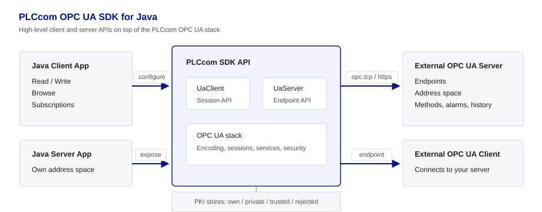
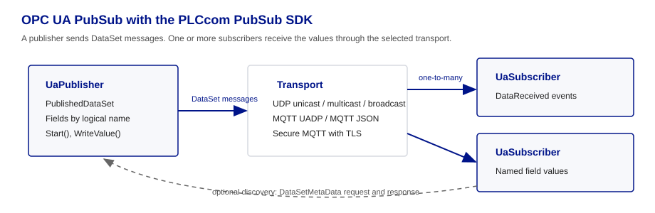

# PLCcom OPC UA SDK for Java — Workshop Examples


This repository provides hands-on workshop examples for developers using the **PLCcom OPC UA SDK for Java**. The examples show how straightforward it is to integrate OPC UA into your Java applications — both as a client connecting to existing servers and as a server exposing your own data.

## Architecture Overview





## Easy to Use — Address Nodes by Path or NodeId

PLCcom supports two ways to address OPC UA nodes: the classic approach using NodeIds (`ns=2;i=12345`) and — unique to PLCcom — by browse path (`Objects.Plant.Line1.Machine1.Temperature`), just like navigating a folder structure. The SDK resolves the path to the corresponding NodeId in the background:

```java
// Resolve a node by path — no cryptic NodeId needed!
NodeId nodeId = client.getNodeIdByPath("Objects.Plant.Line1.Machine1.Temperature");

// Read a value
DataValue value = client.readValue(nodeId);

// Write a value
client.writeValue(nodeId, 23.5);
```

This makes your code **readable, maintainable, and independent of server-specific NodeId assignments**. Of course, classic NodeId-based access is fully supported too.

---

## Licensing Information

**Examples License:**
All examples in this repository are released under the **MIT License**. You are free to use, modify, and distribute them according to the MIT license terms.

**PLCcom Library License:**
The **PLCcom OPC UA SDK** itself is proprietary software and is **NOT** included under the MIT license. To use the library in your own projects you must acquire an appropriate license and accept the EULA. More information: [https://www.indi-an.com/en/plccom/opc-ua-sdk/opcua-overview/](https://www.indi-an.com/en/plccom/opc-ua-sdk/opcua-overview/)

**Trial License:**
A free trial license is available at the [PLCcom download page](https://www.indi-an.com/en/plccom/opc-ua-sdk/opcua-download/).

---

## Overview of PLCcom OPC UA SDK for Java

PLCcom OPC UA SDK is a highly optimized and modern SDK designed specifically for Java developers to provide convenient client and server access for OPC UA (Open Platform Communications Unified Architecture). The library is available as a Maven dependency — no native libraries, no API calls necessary.

### Key Features
- **Path-based node addressing** — access nodes by browse path (e.g. `Objects.Plant.Line1.Temperature`)
- Easy to use — many operations require just a single line of code
- Automatic Connect, Reconnect, and Disconnect functionality
- Active keep-alive monitoring of the server state
- Full **Client SDK** and **Server SDK** in a single artifact
- Support for **opc.tcp** and **opc.https** transport protocols
- Support for the most common OPC UA feature sets:
  - Data Access
  - Alarms and Conditions
  - Historical Data and Historical Events
  - Complex / Structured Data Types
  - Simple Events
  - Reverse Connect
  - NodeSet2 XML Import
- Extensive workshops for Java included

For a full list of supported features and detailed documentation, visit the [official documentation](https://www.indi-an.com/en/plccom/opc-ua-sdk/opcua-overview/).

---

## Workshop Overview

### Client Workshops

**First Steps**

- `11 Discover Server` - Discover available OPC UA servers on the network.
- `12 Connect Endpoint` - Connect to a server endpoint and establish a session.
- `13 Connect with User Auth` - Authenticate with username and password.
- `14 Connect with Cert Auth` - Authenticate with X.509 certificates.
- `15 Browse by NodeId` - Navigate the address space using NodeIds.
- `16 Browse by Path` - Navigate the address space using browse paths.
- `19 Enable Debug Tracing` - Enable diagnostic tracing for troubleshooting.

**Data Access**

- `21 Read/Write by NodeId` - Read and write values using NodeIds.
- `22 Read/Write by Path` - Read and write values using browse paths.
- `23 Monitoring Items` - Subscribe to value changes with monitored items.
- `24 Simple Method Calls` - Call OPC UA methods with input and output arguments.
- `25 Advanced Calls with Structs` - Call methods with nested structures and arrays.
- `26 Read Attributes` - Read node attributes such as DataType and Description.
- `27 Registered Read/Write` - Use high-performance read/write with registered nodes.

**Alarms, History and Events**

- `31 Incoming Alarms` - Subscribe to and display incoming alarm events.
- `32 Alarm List` - Maintain a live list of active alarms.
- `33 Alarm Conditions` - Acknowledge, confirm and comment on alarms.
- `41 Historical Data` - Read historical values.
- `42 Historical Data Update` - Insert, update, replace and delete historical values.
- `43 Read Historical Events` - Read past events from the server history.
- `44 Monitoring Historical Events` - Subscribe to historical event notifications.
- `61 Simple Events` - Subscribe to and display event notifications.

**Complex Types**

- `51 Complex Types` - Read and decode structured data types.

**Reverse Connect**

- `71 Reverse Connect` - Use server-initiated connections through firewalls.

### Server Workshops

**Data Access**

- `11 Simple Server` - Basic OPC UA server with variables.
- `12a User Authentication` - Username/password and certificate authentication with roles.
- `12b Custom Auth Validator` - Custom credential and permission validators.
- `13 Methods` - Expose callable methods in the address space.
- `14 Variables and Arrays` - Various data types, properties, callbacks and array variables.
- `15 Custom Types` - Define and expose custom structured types.
- `16 Multiple Namespaces` - Organize nodes across multiple namespaces.
- `17 Dynamic Nodes` - Create and remove nodes at runtime.
- `19 Advanced Server` - Production-grade server combining Data Access features.

**Alarms, History and Events**

- `21 Alarm Conditions` - Implement alarm conditions with full state management.
- `31 Historical Access` - Store and serve historical data values.
- `32 Historical Update` - Accept Insert, Update, Replace, Remove and Delete from clients.
- `33 Historical Events` - Record and serve historical events.
- `34 Custom History Store` - Implement `UaHistoryStore` for any storage back-end.
- `35 Custom Event History Store` - Implement `UaEventHistoryStore` for any storage back-end.
- `61 Simple Events` - Fire events from the server with severity levels.

**NodeSet, Logging and Reverse Connect**

- `41 NodeSet Import` - Import OPC UA NodeSet2 XML files into the address space.
- `51 Logging` - Configure server-side logging and route it to your framework.
- `71 Reverse Connect` - Use server-initiated connections through firewalls.

### PubSub Workshops

- `11 / 12 UADP Unicast` - Publish and receive UADP DataSetMessages via OPC UA UDP unicast with PubSub discovery.
- `13 / 14 UADP Multicast` - Publish and receive pressure values through an OPC UA UDP multicast group.
- `15 / 16 UADP Broadcast` - Publish and receive OPC UA UDP broadcast messages.
- `21 / 22 MQTT UADP` - Publish and receive UADP NetworkMessages through an MQTT broker.
- `23 / 24 Secure MQTT UADP` - Use MQTT over TLS with UADP binary encoding and broker certificate validation.
- `31 / 32 MQTT JSON` - Publish and receive OPC UA PubSub JSON data messages through MQTT.
- `33 / 34 Secure MQTT JSON` - Use MQTT over TLS with JSON encoding and broker certificate validation.

The PubSub workshops live in `PubSub_Samples` and use the PubSub add-on Maven dependency. For MQTT workshops, use a broker on `mqtt://localhost:1883`; for secure MQTT workshops, use a TLS-enabled broker on `mqtts://localhost:8883`.

### Client ↔ Server Pairing

Many client workshops are designed to work with a specific server workshop. Start the server first, then run the matching client:

**Getting connected**  
Use `11 Discover Server` with any reachable server. Then run `12 Connect Endpoint` against `11 Simple Server`. Workshops `13 Connect with User Auth` and `14 Connect with Cert Auth` pair with `12a User Authentication` for username/password and certificate authentication.

**Browsing and live data**  
Workshops `15 Browse by NodeId` and `16 Browse by Path` browse the address space of `11 Simple Server`. Workshops `21 Read/Write by NodeId`, `22 Read/Write by Path`, `23 Monitoring Items` and `27 Registered Read/Write` also use `11 Simple Server` for read/write, subscriptions and registered nodes.

**Methods and structured data**  
Workshops `24 Simple Method Calls` and `25 Advanced Calls with Structs` pair with `13 Methods`. Workshop `26 Read Attributes` pairs with `14 Variables and Arrays`.

**Complex Types**  
Workshop `51 Complex Types` pairs with `15 Custom Types`.

**Alarms, history and events**  
Client workshops `31 Incoming Alarms` to `33 Alarm Conditions` pair with `21 Alarm Conditions`. Historical data and event workshops `41 Historical Data` to `44 Monitoring Historical Events` pair with server workshops `31 Historical Access` to `33 Historical Events`. Workshop `61 Simple Events` pairs with `61 Simple Events`.

**Reverse Connect**  
Workshop `71 Reverse Connect` pairs with `71 Reverse Connect`.

---

## Requirements

- Java 11 or newer
- Maven 3.6 or newer
- Any Java IDE (IntelliJ IDEA, Eclipse, VS Code with Java extension)

## Getting Started

### 1. Clone this repository

```bash
git clone https://github.com/Indi-An/PLCcom-OpcUaSdk-examples-java.git
cd PLCcom-OpcUaSdk-examples-java
```

### 2. Add your license credentials

Each workshop file contains a placeholder for your license credentials:

```java
String licenseUser   = "<Enter your UserName here>";
String licenseSerial = "<Enter your Serial here>";
```

Replace these with the credentials from your license e-mail. A free trial license is available at the [PLCcom download page](https://www.indi-an.com/en/plccom/opc-ua-sdk/opcua-download/).

### 3. Build

Build all workshop projects from the repository root:

```bash
mvn clean compile
```

This builds the shared `PLCcom.Console` helper first and then the client/server and PubSub workshop projects.

You can also build the projects individually:

```bash
cd Client_Server_Samples
mvn clean compile

cd ../PubSub_Samples
mvn clean compile
```

### 4. Run a workshop

Open the desired workshop class in your IDE and run its `main()` method directly, or use Maven:

```bash
cd Client_Server_Samples

# Example: run Server Workshop 11
mvn exec:java -Dexec.mainClass=_11_SimpleServer

# Example: run Client Workshop 21
mvn exec:java -Dexec.mainClass=_21_ReadWriteByNodeId
```

For PubSub workshops, start the subscriber first and the matching publisher in a second console:

```bash
cd PubSub_Samples

# Console 1: subscriber
mvn exec:java -Dexec.mainClass=_12_UadpUnicastSubscriber

# Console 2: publisher
mvn exec:java -Dexec.mainClass=_11_UadpUnicastPublisher
```

---

## Project Structure

```
PLCcom-OpcUaSdk-examples-java/
├── PLCcom.Console/              ← shared Maven project for the workshop console window
├── PubSub_Samples/              ← OPC UA PubSub add-on workshops
├── Client_Server_Samples/
│   ├── Client/
│   │   ├── src/main/java/      ← all client workshop Java files
│   │   │   └── README.md
│   │   └── README.md
│   ├── Server/
│   │   ├── src/main/java/      ← all server workshop Java files
│   │   │   ├── PLCcom_Workshop_NodeSet.xml
│   │   │   └── README.md
│   │   └── README.md
│   ├── pom.xml
│   └── README.md
├── pom.xml                      ← Maven reactor build for all projects
├── .gitignore
├── LICENSE
└── README.md
```

---

## ⚠️ Important Safety Notice

The examples in this repository are **for demonstration purposes only** and **must _not_** be used in production, safety-critical, or industrial environments without your own thorough review and validation.
**Use at your own risk!** Deploying these examples in real systems may lead to personal injury, property damage, or environmental harm and is **strictly prohibited**.

The author disclaims all liability — direct, indirect, incidental, or consequential — arising from the use or misuse of these examples.

---

##### Trademark Information
All product names, company names, and trademarks referenced in this repository are trademarks or registered trademarks of their respective owners. There is no affiliation between the mentioned trademarks or their owners and Indi.An GmbH. Any mention of trademarks is solely for reference purposes.
